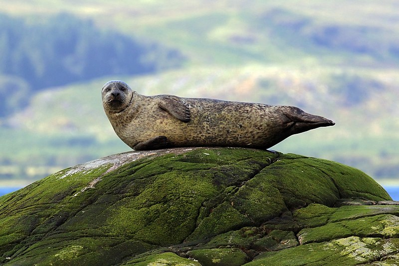

# Seal World

Welcome to *Seal World*, where we dive into the fascinating lives of these aquatic wonders!

## Table of Contents
- [Introduction](#introduction)
- [Exploring the World of Seals](#exploring-the-world-of-seals)
- [Style and Moves](#style-and-moves)
- [Seal Hangouts](#seal-hangouts)
- [Meet the Seal Crew](#meet-the-seal-crew)
- [Cool Facts About Seals](#cool-facts-about-seals)

## Introduction

Get ready to Seal-abrate! Dive into the charm of these aquatic wonders.

## Exploring the World of Seals

Hold onto your flippers as we embark on a journey into the lives of seals! These adorable aquatic mammals have mastered the art of enjoying life both above and below the waves. Let's splash into the deep waters of seal knowledge!

## Style and Moves

Seals showcase elegant swimming skills, rivalling top-tier Olympic swimmers. Their streamlined bodies move with fluidity and grace, a testament to nature's adaptability. Their natural insulation, layers of blubber, allows them to thrive in various water temperatures.

## Seal Hangouts

Discover where these fantastic creatures hang out – from icy polar plunge zones to sunny coastal chill spots. Seals love lounging on rocky shores, showing off their sun-kissed fur, and occasionally doing the cha-cha-slide into the water.

## Meet the Seal Crew

   

Meet the VIPs (Very Important Pinnipeds)! From the harbor seal to the fierce leopard seal, each has its quirks and skills, making them the true icons of the underwater red carpet.

## Cool Facts About Seals

Dive into the world of seals, those charming sea creatures with a flair for the extraordinary. From holding their breath like underwater champs to using their whiskers for underwater GPS, these marine wonders are quite the showstoppers.

For a deeper dive into seal awesomeness, visit [sealworld.com](#).

---

Made with ❤ by [@ana-livia-castro](https://github.com/ana-livia-castro)
